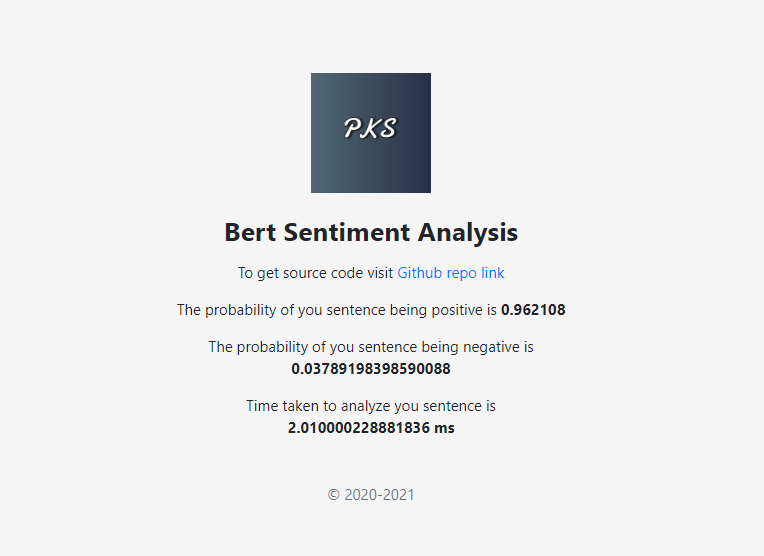
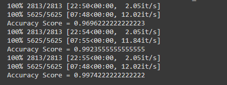

# Bert Sentiment Analysis #
### Introduction ###

### how to use ###
* make sure you have docker installed
* then use next command to build the docker image <b> docker build -t bert-docker . </b>
* to run this container use <b> docker run -d -p 9999:9999 -e PORT=9999 bert-docker:latest </b>

### Requirements ### 
* Pytorch
* Flask
* Python
* HTML/CSS/JS

### Demo Images ###

  
<b>Index page which take sentence as a input. </b>

    

   
  
 <b> Output page to display the prediction </b>

    

### Accuracy ###

    

